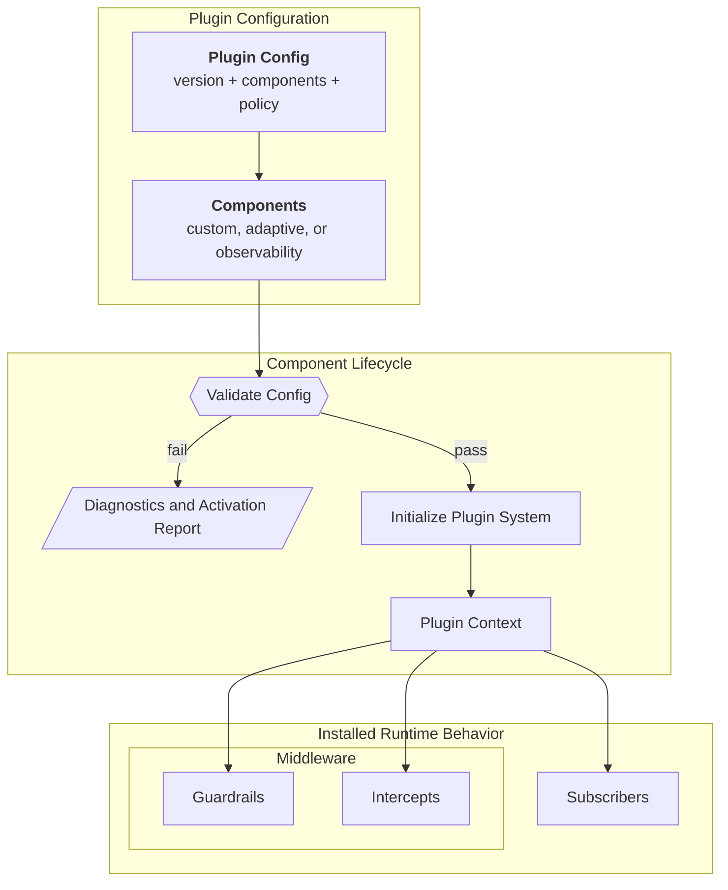

import { MermaidStyles } from "@/components/MermaidStyles";

{/* SPDX-FileCopyrightText: Copyright (c) 2026, NVIDIA CORPORATION & AFFILIATES. All rights reserved.
SPDX-License-Identifier: Apache-2.0 */}

This page explains how plugins package reusable runtime behavior behind configuration.

## Why Plugins Exist

Plugins let NeMo Relay install reusable runtime behavior from configuration
instead of requiring every application or framework integration to register the
same middleware and subscribers by hand.

They are the main packaging layer for reusable runtime components.

## Plugin Configuration Model

The canonical plugin document has three main areas:

- `version`
- `components`
- `policy`

### Version

The version identifies the configuration format expected by the plugin system.

### Components

Components describe the individual runtime pieces to activate. Each component
declares what it is and which config it should use.

### Policy

Policy controls how strictly the plugin system interprets unknown fields,
unsupported values, or compatibility issues.

## Component Lifecycle

Plugins follow a small lifecycle rather than registering everything blindly.

### Validation

Validation checks whether the supplied config is structurally and semantically
acceptable before initialization.

### Initialization

Initialization activates the configured components and registers their runtime
behavior.

### Activation Reporting

Reporting provides structured diagnostics about what activated successfully and
what did not.

### Failure Boundary

Plugin validation and initialization are setup boundaries. If configuration is
invalid, a component kind is unavailable, or initialization fails, callers should
treat the plugin setup as failed before relying on the new runtime behavior.
Activation reports are the public way to inspect what validated or activated.

Runtime behavior after activation still belongs to the installed component. For
example, an exporter can report delivery failures without changing tool or LLM
execution semantics. Keep those component-specific failure rules in the
component guide rather than redefining them in the plugin concept.

<MermaidStyles />

## Plugin Context

The plugin context is the runtime surface that a component uses to register its
behavior. This is where plugins connect configuration to real runtime state.

## What Plugins Can Register

Depending on the component, a plugin can register:

- Middleware
- Subscribers
- Related runtime helpers

This is what makes plugins a packaging mechanism rather than a separate runtime
model. Plugins do not replace scopes, middleware, or subscribers. They install
them.

## Ownership and Scope

Plugin initialization is process-level. It is intended for runtime components
that should activate once for the running process rather than once per request.

Scope-local behavior still matters after plugin installation, but the plugin
system itself is a global activation layer.

Plugins install runtime behavior; they do not create a separate execution
model. Scopes still own parentage and cleanup, middleware still owns execution
ordering, and events still own the canonical runtime record.

## Built-In Plugin Components

The core runtime registers the `observability`, `nemo_guardrails`, and
`pricing` components before lookup, validation, and initialization. The CLI and
the Python and Node.js bindings also register `adaptive` and `pii_redaction`.
Direct Rust applications must register Adaptive and PII Redaction from their
component crates before validating or initializing either kind:
`nemo_relay_adaptive::plugin_component::register_adaptive_component()` and
`nemo_relay_pii_redaction::component::register_pii_redaction_component()`.
Applications can still register custom plugins.

### Adaptive

Adaptive is implemented as a built-in plugin component. It is not a separate
runtime model. It uses the same plugin system as custom components.

This matters conceptually because adaptive behavior is configured and activated
through the same component lifecycle as other plugins. Direct Rust applications
follow this sequence:

1. Call `nemo_relay_adaptive::plugin_component::register_adaptive_component()`.
2. Validate the config.
3. Initialize the plugin system.
4. Inspect the activation result if needed.

Detailed adaptive configuration belongs in
[Adaptive Configuration](/configure-plugins/adaptive/configuration),
[Adaptive Cache Governor (ACG)](/configure-plugins/adaptive/acg), and
[Adaptive Hints](/configure-plugins/adaptive/adaptive-hints).

### Observability

The core crate ships a built-in `observability` plugin component for Agent
Trajectory Observability Format (ATOF), Agent Trajectory Interchange Format
(ATIF), OpenTelemetry, and OpenInference exporters. Each exporter section is
disabled unless its section sets `enabled = true`, and subscriber names are
inferred from the plugin namespace instead of exposed in public config.

Detailed observability plugin configuration belongs in
[Observability Configuration](/configure-plugins/observability/configuration).

### NeMo Guardrails

The core crate also ships a built-in `nemo_guardrails` plugin component. It is
the first-party Guardrails integration point that NeMo Relay owns through the
shared plugin system.

The current shipped user-facing paths are:

- The remote backend for Guardrails-service integration
- The Python-backed local backend for `nemoguardrails` integration through a
  subprocess worker

Detailed Guardrails plugin configuration belongs in
[NeMo Guardrails Configuration](/configure-plugins/nemo-guardrails/configuration).

### PII Redaction

The `pii_redaction` component sanitizes emitted observability payloads without
changing real callback arguments or results. The CLI and primary language
bindings register this component. Direct Rust applications must call
`nemo_relay_pii_redaction::component::register_pii_redaction_component()`
before they validate or initialize a PII Redaction component.

Configure actions, detectors, targets, and backend modes through [PII Redaction
Configuration](/configure-plugins/pii-redaction/configuration).

### Model Pricing

The core crate ships a built-in `pricing` component. It loads catalog sources
that response codecs can use to annotate managed LLM responses with cost
estimates. Configure catalog sources through [Model Pricing](/configure-plugins/model-pricing).

For `plugins.toml` discovery, precedence, merge, and gateway editing rules,
refer to [Plugin Configuration Files](/configure-plugins/plugin-configuration-files).

## Discoverable Plugins

Discoverable plugins use the same component lifecycle, but the CLI reads a
`relay-plugin.toml` manifest before it creates an internal component. The
manifest identifies a Rust native shared library or a local `grpc-v1` worker,
declares compatibility and capabilities, and supplies integrity evidence for
the artifact.

The operator keeps the manifest reference and component configuration in
`plugins.toml`. Use `nemo-relay plugins validate <plugin-id>` to check the
manifest, optional static schema, host policy, compatibility, and trust
evidence before enabling or running a dynamic plugin. During startup, Relay
loads the enabled adapter and then validates the synthesized component. Refer
to [Configure Discoverable Plugins](/configure-plugins/discoverable-plugins)
for the operator workflow and [Discoverable Plugins](/build-plugins/dynamic-plugins/about)
for the authoring model.

## Practical Guidance

Use these practices when applying the concept in application or integration code.

- Use plugins when behavior should be reusable across applications or
  integrations.
- Validate plugin config before initialization.
- Treat plugins as the configuration-driven installation path for runtime
  behavior.
- Keep detailed field-by-field config questions in the relevant guide for that plugin component.
